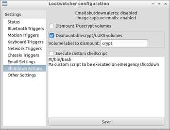

lockwatcher
===========

Anti-forensic monitor program: watches for signs of forensic aquisition and purges keys/shuts everything down.
Pretty much everything is written in Python 3

This program is the result of my masters thesis on anti-forensics and was written as part of a case-study on
building a forensic aquisition/analysis resistant sytem.

TL;DR

* You lock computer whenever not physically present at it.

* Someone attempts to do something to computer (or walks in room - there are lots of trigger options).

* Encryption keys are purged, computer shuts down, your data is safe. Probably.

Install
=============
* sudo apt-get install motion ifplugd lm-sensors

* Install Imapclient (https://pypi.python.org/pypi/IMAPClient/0.10.2) by whatever method is convenient 

* [download/unzip lockwatcher]

* sudo setupfiles/setup.sh

Configuration
================
sudo src/lockwatcher-gui/lockwatcher-gui.py

Run
============
sudo src/lockwatcher.py start

Using remote control
====================
* Install QPython on your Android device

* Go to http://qpython.com/create.php, paste in mobilecontrol.py

* Edit emails,password to your liking and add the authentication secret

* Generate the QRCode, scan with QPython on your phone

* Save it as a script

Notes
===========
I just uploaded this and it has only been tested on lubuntu, so good luck installing it.

To-do list
===========
The whole qpython thing is a bit of a pain to use: an app could be much nicer

RAM temperature monitoring. My motherboard won't play nice with decode-dimms and I havent had much luck doing what the ballistix MOD utility does. 
Also: other types of RAM

Maybe use the DBUS for some IPC to play nice with the GUI program for monitoring lockwatcher status as it is running. Not too important.

Testing and better install configurations for other linux distros

A Windows version! I made a start and in a few ways it is easier but haven't looked into alternatives for motion monitoring yet. Not really convinced Python is the best language for this either.
 
